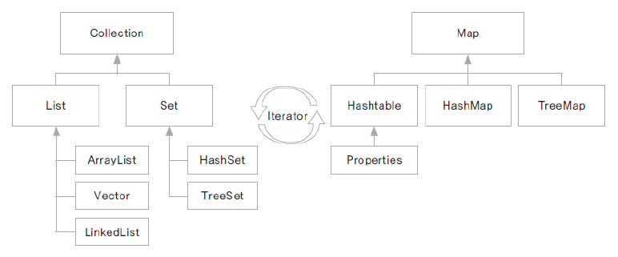

컬렉션 프레임워크
---------------
1. 프로그램 구현에 필요한 자료구조를 구현해 놓은 jdk 라이브러리
2. java.util 패키지에 구현되어 있음
3. 개발에 소요되는 시간을 절약하면서 최적의 알고리즘 사용 가능
4. 여러 구현 클래스와 인터페이스 활용에 대한 이해가 필요함.

각 인터페이스 별 특징
-----------

Collection
---------------
1. 하나의 객체를 관리하기 위한 메서드가 선언된 인터페이스의 하위에 List set이 있음

List
------------
1. 객체 순서에따라 저장하고 관리
2. 배열 연결리스트, 스택 큐 등이 있음

Set
-------
1. 순서와 상관 없이 중복을 허용하지 않고 유일한 값을 관리하는데 필요한 메서드가 선언됨
2. 아이디, 주민번호, 사번등 관리하는데 유용
3. 저장된 순서와 출력되는 순서는 다를 수있음

Map
----------
1. 쌍으로 이루어진 객체를 관리하는데 사용하는 메서드들이 선언된 인터페이스
2. 객체는 key- value의 쌍으로 이루어짐
3. key는 중복 x
4. 